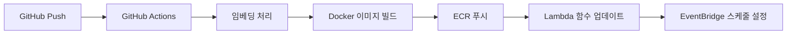

# RAG Price Tracker

## 프로젝트 개요

RAG (Retrieval-Augmented Generation) 기술을 활용한 지능형 가격 추적 시스템입니다.
사내 판매 상품과 경쟁사 상품 간의 가격 비교를 자동화하여 효율적인 가격 모니터링을 제공합니다.

## 핵심 아이디어

### 1. 상품 벡터화 및 저장

- BigQuery에서 사내 판매 중인 상품 목록 조회
- 상품 스펙을 벡터화하여 ChromaDB에 저장
- 상품 간 유사도 측정을 위한 임베딩 생성

### 2. 키워드 추출 및 관리

- 상품에 붙은 키워드를 체계적으로 목록화
- 크롤링 대상 키워드 풀 구성
- 키워드 기반 검색 최적화

### 3. 지능형 크롤링 시스템

- 키워드 기반 타깃 사이트 크롤링
- 최저 가격 순으로 상품 정렬
- 다양한 쇼핑몰 및 판매 사이트 지원

### 4. AI 기반 상품 매칭

- 크롤링된 상품과 벡터 DB 상품 간 유사도 측정
- 높은 유사도를 가진 제품 자동 매칭
- 정확한 가격 비교를 위한 상품 검증

### 5. 자동화된 리포팅 시스템

- 정해진 시간마다 가격 분석 리포트 자동 생성
- 슬랙을 통한 실시간 알림 시스템
- 가격 변동 추이 및 경쟁 분석 제공

### 6. AI 기반 인사이트 분석 (시험적 기능)

- 가격 히스토리 데이터 분석
- AI가 생성하는 시장 트렌드 견해
- 슬랙을 통한 AI 분석 리포트 전송

## 기술 스택

### 🏗️ 인프라 & 배포

- **컨테이너**: Docker (Lambda Container Image)
- **서버리스**: AWS Lambda
- **스케줄링**: AWS EventBridge (CloudWatch Events)
- **CI/CD**: GitHub Actions

### 🧠 AI & 데이터

- **벡터 데이터베이스**: ChromaDB (도커 이미지 내 포함)
- **임베딩 모델**: OpenAI text-embedding-3-small
- **유사도 측정**: Cosine Similarity (scikit-learn)

### 🕷️ 크롤링 & 데이터 수집

- **HTTP 클라이언트**: httpx (비동기 지원)
- **HTML 파싱**: BeautifulSoup4
- **브라우저 자동화**: Playwright (헤드리스, 람다 최적화)

### 🚀 비동기 처리 & 데이터 검증

- **비동기 처리**: asyncio
- **데이터 검증**: Pydantic v2

### 💾 데이터베이스 & 저장소

- **메인 DB**: BigQuery (데이터 웨어하우스)
- **캐시**: Redis (ElastiCache Serverless)

### 📢 알림 & 모니터링

- **메시징**: Slack API (slack-sdk)
- **모니터링**: AWS CloudWatch
- **로깅**: AWS CloudWatch Logs

### 🔧 개발 도구

- **언어**: Python 3.12
- **패키지 관리**: Poetry
- **코드 품질**: Black, isort, flake8
- **테스트**: pytest, pytest-asyncio

## 🏛️ 서버리스 아키텍처

### Lambda 함수 구성

1. **상품 임베딩 함수** (`product-embedder`)

   - BigQuery에서 사내 상품 목록 조회
   - 상품 스펙을 OpenAI API로 임베딩
   - ChromaDB에 벡터 저장 (도커 이미지 내 포함)

2. **크롤링 함수** (`price-crawler`)

   - 키워드 기반 타깃 사이트 크롤링
   - Playwright로 동적 콘텐츠 처리
   - 크롤링 결과를 BigQuery에 저장

3. **매칭 함수** (`product-matcher`)

   - 크롤링된 상품과 벡터 DB 유사도 계산
   - 높은 유사도 상품 자동 매칭
   - 가격 비교 결과 생성

4. **리포팅 함수** (`report-generator`)

   - 가격 분석 리포트 생성
   - Slack API로 알림 전송
   - BigQuery에 히스토리 데이터 업데이트

5. **AI 인사이트 함수** (`ai-insights`) - 시험적 기능
   - BigQuery에서 가격 히스토리 데이터 분석
   - OpenAI API를 통한 시장 트렌드 견해 생성
   - 슬랙으로 AI 분석 리포트 전송

### CI/CD 파이프라인

### 스케줄링 전략

- **일일 크롤링**: 매일 오전 6시 (EventBridge Cron)
- **매칭 & 분석**: 크롤링 완료 후 트리거
- **주간 리포트**: 매주 월요일 오전 9시
- **긴급 알림**: 가격 변동 임계값 초과 시 즉시
- **AI 인사이트**: 매주 금요일 오후 5시 (시험적 기능)

### 🎯 기술 선택 근거

**왜 Lambda + Docker인가?**

- **비용 효율성**: 실행 시간만큼만 과금 (크롤링은 하루 1-2회)
- **무한 확장성**: 동시 크롤링 사이트 수 제한 없음
- **운영 부담 최소화**: 서버 관리 불필요
- **컨테이너 지원**: 복잡한 의존성 (Playwright 등) 패키징 가능

**도커 이미지 내 벡터 DB (ChromaDB) 선택 이유**

- **응답 속도**: 네트워크 지연 없는 로컬 검색
- **비용 절약**: 외부 벡터 DB 서비스 및 스토리지 비용 없음
- **데이터 보안**: 민감한 상품 정보 외부 유출 방지
- **배포 간소화**: 데이터와 코드가 하나의 컨테이너에 통합

## 주요 기능

1. **상품 등록 및 관리**

   - BigQuery를 통한 상품 데이터 관리
   - 상품 정보 벡터화 및 저장
   - 상품 카테고리 및 키워드 관리

2. **경쟁사 가격 모니터링**

   - 실시간 가격 추적
   - 가격 변동 히스토리 관리

3. **지능형 상품 매칭**

   - AI 기반 유사 상품 자동 검출
   - 정확도 높은 가격 비교

4. **리포팅 및 알림**

   - 일/주/월 단위 리포트
   - 임계값 기반 즉시 알림

5. **AI 인사이트 분석** (시험적 기능)
   - 가격 히스토리 기반 트렌드 분석
   - AI 생성 시장 견해 및 추천사항
   - 슬랙을 통한 인사이트 리포트

## 기대 효과

- **업무 효율성 향상**: 수동 가격 조사 시간 단축
- **경쟁력 강화**: 실시간 시장 가격 모니터링
- **의사결정 지원**: 데이터 기반 가격 전략 수립
- **리스크 관리**: 가격 경쟁력 저하 조기 감지
- **AI 인사이트**: 가격 히스토리 기반 시장 트렌드 분석 및 전략적 견해 제공

## 🗓️ 개발 로드맵

### Phase 1: 서버리스 인프라 구축

- **Docker 컨테이너 환경 구축**
  - Lambda Container Image 베이스 설정
  - Poetry 기반 의존성 관리
  - 로컬 개발 환경 구성
- **AWS 인프라 설정**
  - Lambda 함수 생성 및 배포
  - BigQuery 데이터셋 및 테이블 설계
  - EventBridge 스케줄링 설정

### Phase 2: 핵심 기능 개발

- **상품 임베딩 시스템**
  - BigQuery 연동 및 데이터 읽기/쓰기
  - OpenAI API 연동
  - ChromaDB 도커 이미지 내 벡터 저장
- **크롤링 엔진 구축**
  - Playwright 기반 크롤러 개발
  - 다중 사이트 크롤링 지원
  - 에러 핸들링 및 재시도 로직
- **AI 매칭 알고리즘**
  - 코사인 유사도 계산
  - 매칭 임계값 최적화
  - 성능 튜닝

### Phase 3: 자동화 및 모니터링

- **CI/CD 파이프라인**
  - GitHub Actions 워크플로우
  - ECR 이미지 자동 배포
  - 테스트 자동화
- **리포팅 & 알림 시스템**
  - Slack API 연동
  - 리포트 템플릿 개발
  - CloudWatch 모니터링 대시보드

### Phase 4: 고도화 및 확장

- **성능 최적화**
  - Lambda 콜드 스타트 최적화
  - 병렬 처리 개선
  - 메모리 사용량 튜닝
- **운영 도구 개발**
  - 관리용 CLI 도구
  - 데이터 백업/복구 스크립트
  - 모니터링 알람 설정
- **AI 인사이트 기능** (시험적)
  - 가격 히스토리 데이터 분석 엔진
  - OpenAI 기반 시장 트렌드 견해 생성
  - 슬랙 인사이트 리포트 자동화

---

_본 프로젝트는 AI 기술을 활용한 혁신적인 가격 추적 시스템으로, 커머스 경쟁력 강화를 목표로 합니다._
