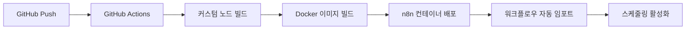

# RAG Price Tracker

## 프로젝트 개요

RAG (Retrieval-Augmented Generation) 기술을 활용한 지능형 가격 추적 시스템입니다.
사내 판매 상품과 경쟁사 상품 간의 가격 비교를 자동화하여 효율적인 가격 모니터링을 제공합니다.

## 아키텍처 개요

### 🎵 워크플로우 오케스트레이션

**n8n**을 핵심 워크플로우 오케스트레이터로 사용하여 다음과 같은 복잡한 데이터 파이프라인을 시각적으로 관리합니다:

- **상품 임베딩 파이프라인**: BigQuery → 임베딩 모델 → ChromaDB
- **크롤링 파이프라인**: 키워드 기반 다중 사이트 크롤링
- **매칭 파이프라인**: 벡터 유사도 계산 및 상품 매칭
- **리포팅 파이프라인**: 분석 결과 → Slack 알림

### 🏠 로컬 개발 환경

**Docker & Docker Compose**를 사용하여 로컬 개발 환경을 구성합니다:

- **컨테이너화된 n8n**: 일관된 개발 환경 제공
- **데이터 지속성**: 컨테이너 재시작 시에도 워크플로우 유지
- **간편한 설정**: 한 번의 명령으로 전체 환경 구성

## 핵심 아이디어

### 1. 상품 벡터화 및 저장

- BigQuery에서 사내 판매 중인 상품 목록 조회
- 상품 스펙을 벡터화하여 ChromaDB에 저장
- 상품 간 유사도 측정을 위한 임베딩 생성

### 2. 키워드 추출 및 관리

- 상품에 붙은 키워드를 체계적으로 목록화
- 크롤링 대상 키워드 풀 구성
- 키워드 기반 검색 최적화

### 3. 지능형 크롤링 시스템

- 키워드 기반 타깃 사이트 크롤링
- 최저 가격 순으로 상품 정렬
- 다양한 쇼핑몰 및 판매 사이트 지원

### 4. AI 기반 상품 매칭

- 크롤링된 상품과 벡터 DB 상품 간 유사도 측정
- 높은 유사도를 가진 제품 자동 매칭
- 정확한 가격 비교를 위한 상품 검증

### 5. 자동화된 리포팅 시스템

- 정해진 시간마다 가격 분석 리포트 자동 생성
- 슬랙을 통한 실시간 알림 시스템
- 가격 변동 추이 및 경쟁 분석 제공

### 6. 데이터 인사이트 분석 (시험적 기능)

- 가격 히스토리 데이터 분석
- 통계적 트렌드 분석 및 패턴 추출
- 슬랙을 통한 데이터 분석 리포트 전송

## 기술 스택

### 🎵 워크플로우 오케스트레이션

- **워크플로우 엔진**: n8n (Visual workflow builder)
- **커스텀 노드**: TypeScript 기반 n8n 확장 노드
- **스케줄링**: n8n Cron 트리거
- **에러 핸들링**: n8n 워크플로우 내장 에러 처리

### 🏗️ 인프라 & 배포

- **로컬 개발**: Docker & Docker Compose
- **컨테이너**: Docker (서버리스 배포 가능)
- **스케줄링**: n8n 내장 Cron 및 트리거
- **CI/CD**: GitHub Actions

### 🧠 AI & 데이터

- **벡터 데이터베이스**: ChromaDB (컨테이너 내 포함)
- **임베딩 모델**: Sentence Transformers / HuggingFace 모델
- **유사도 측정**: Cosine Similarity (scikit-learn)

### 🕷️ 크롤링 & 데이터 수집

- **HTTP 클라이언트**: httpx (비동기 지원)
- **HTML 파싱**: BeautifulSoup4
- **브라우저 자동화**: Playwright (헤드리스, 람다 최적화)

### 🚀 비동기 처리 & 데이터 검증

- **비동기 처리**: asyncio
- **데이터 검증**: Pydantic v2

### 💾 데이터베이스 & 저장소

- **메인 DB**: BigQuery (데이터 웨어하우스)
- **캐시**: Redis (ElastiCache Serverless)

### 📢 알림 & 모니터링

- **메시징**: Slack API (slack-sdk)
- **모니터링**: AWS CloudWatch
- **로깅**: AWS CloudWatch Logs

### 🔧 개발 도구

- **언어**: Python 3.12
- **패키지 관리**: Poetry
- **코드 품질**: Black, isort, flake8
- **테스트**: pytest, pytest-asyncio

## 🏛️ n8n 워크플로우 아키텍처

### 핵심 워크플로우 구성

1. **상품 임베딩 워크플로우** (`product-embedder`)

   - BigQuery에서 사내 상품 목록 조회
   - 상품 스펙을 임베딩 모델로 벡터화
   - ChromaDB에 벡터 저장 (컨테이너 내 포함)

2. **크롤링 워크플로우** (`price-crawler`)

   - 키워드 기반 타깃 사이트 크롤링
   - Playwright로 동적 콘텐츠 처리
   - 크롤링 결과를 BigQuery에 저장

3. **매칭 워크플로우** (`product-matcher`)

   - 크롤링된 상품과 벡터 DB 유사도 계산
   - 높은 유사도 상품 자동 매칭
   - 가격 비교 결과 생성

4. **리포팅 워크플로우** (`report-generator`)

   - 가격 분석 리포트 생성
   - Slack API로 알림 전송
   - BigQuery에 히스토리 데이터 업데이트

5. **AI 인사이트 워크플로우** (`ai-insights`) - 시험적 기능
   - BigQuery에서 가격 히스토리 데이터 분석
   - LLM을 통한 시장 트렌드 견해 생성 (모델 미정)
   - 슬랙으로 AI 분석 리포트 전송

### n8n 워크플로우 파이프라인



### n8n 스케줄링 전략

- **일일 크롤링**: 매일 오전 6시 (n8n Cron 트리거)
- **매칭 & 분석**: 크롤링 완료 후 워크플로우 자동 체인
- **주간 리포트**: 매주 월요일 오전 9시 (n8n 스케줄러)
- **긴급 알림**: 가격 변동 임계값 초과 시 즉시 (n8n 조건부 트리거)
- **데이터 인사이트**: 매주 금요일 오후 5시 (n8n 스케줄러, 시험적 기능)

### 🎯 기술 선택 근거

**왜 n8n + Docker인가?**

- **워크플로우 통합**: 모든 스케줄링과 데이터 파이프라인을 시각적으로 관리
- **AWS 독립성**: 외부 스케줄링 서비스 의존도 최소화
- **개발 효율성**: 코드 작성 없이 드래그 앤 드롭으로 워크플로우 구성
- **유지보수성**: 비즈니스 로직 변경 시 워크플로우만 수정
- **확장성**: 커스텀 노드로 필요한 기능 확장 가능

**컨테이너 내 벡터 DB (ChromaDB) 선택 이유**

- **응답 속도**: 네트워크 지연 없는 로컬 검색
- **비용 절약**: 외부 벡터 DB 서비스 및 스토리지 비용 없음
- **데이터 보안**: 민감한 상품 정보 외부 유출 방지
- **배포 간소화**: 데이터와 코드가 하나의 컨테이너에 통합
- **n8n 연동**: 워크플로우 내에서 직접 벡터 DB 접근 가능

## 주요 기능

1. **n8n 워크플로우 기반 상품 관리**

   - BigQuery를 통한 상품 데이터 관리
   - 상품 정보 벡터화 및 저장
   - 상품 카테고리 및 키워드 관리

2. **자동화된 경쟁사 가격 모니터링**

   - n8n 스케줄러 기반 실시간 가격 추적
   - 가격 변동 히스토리 관리

3. **RAG 기반 지능형 상품 매칭**

   - 벡터 유사도 기반 상품 자동 검출
   - 정확도 높은 가격 비교

4. **n8n 통합 리포팅 및 알림**

   - 워크플로우 내장 리포트 생성
   - 임계값 기반 즉시 알림
   - 다양한 조건부 트리거

5. **데이터 인사이트 분석** (시험적 기능)
   - 가격 히스토리 기반 트렌드 분석
   - 데이터 분석 및 패턴 추출
   - 슬랙을 통한 인사이트 리포트

## 기대 효과

- **업무 효율성 향상**: 수동 가격 조사 시간 단축
- **경쟁력 강화**: 실시간 시장 가격 모니터링
- **의사결정 지원**: 데이터 기반 가격 전략 수립
- **리스크 관리**: 가격 경쟁력 저하 조기 감지
- **데이터 인사이트**: 가격 히스토리 기반 시장 트렌드 분석 및 패턴 추출

## 🚀 로컬 개발 환경

### 전제 조건

- Docker & Docker Compose 설치
- Git 클라이언트

### 설치 및 실행

1. **프로젝트 클론**

   ```bash
   git clone <repository-url>
   cd rag-price-tracker
   ```

2. **n8n 컨테이너 시작**

   ```bash
   # 빌드 & 백그라운드 실행
   docker compose up --build -d

   # 포그라운드 실행 (로그 확인)
   docker compose up --build
   ```

3. **n8n 웹 인터페이스 접속**

   - URL: http://localhost:5678
   - 기본 계정: admin / admin

4. **컨테이너 정지 및 정리**

   ```bash
   # 컨테이너 정지 및 삭제
   docker compose down

   # 볼륨까지 함께 삭제
   docker compose down -v

   # 완전 정리 (볼륨, 이미지, 빌드 캐시 모두 삭제)
   docker compose down -v --rmi all
   docker system prune -a --volumes
   ```

### 개발 환경 구조

```
rag-price-tracker/
├── docker-compose.yml          # 서비스 구성
├── Dockerfile                  # n8n 컨테이너 이미지
├── .gitignore                  # Git 제외 파일
├── n8n_data/                   # n8n 워크플로우 데이터 (git 제외)
├── nodes/                      # 커스텀 n8n 노드들
└── workflows/                  # 워크플로우 템플릿
```

### 주요 특징

- **데이터 지속성**: `n8n_data/` 디렉토리에 워크플로우 및 설정 저장
- **Hot Reload**: 코드 변경 시 자동 반영
- **포트 격리**: 각 서비스별 포트 분리
- **볼륨 매핑**: 로컬 파일과 컨테이너 동기화

## 🗓️ 개발 로드맵

### Phase 1: n8n 기반 워크플로우 구축

- **로컬 개발 환경 구축**
  - Docker & Docker Compose 설정
  - n8n 컨테이너 구성
  - 데이터 지속성 및 볼륨 매핑
- **기본 인프라 연동**
  - BigQuery 데이터셋 및 테이블 설계
  - 임베딩 모델 환경 설정
  - Slack 웹훅 설정

### Phase 2: 커스텀 n8n 노드 개발

- **RAG 전용 노드 개발**
  - BigQuery Reader/Writer 노드
  - Text Embeddings 노드 (Sentence Transformers)
  - ChromaDB Vector Store 노드
  - Product Matcher 노드
- **크롤링 전용 노드 개발**
  - Multi-site Crawler 노드
  - Price Extractor 노드
  - Data Validator 노드

### Phase 3: 워크플로우 구성

- **핵심 워크플로우 구축**
  - 상품 임베딩 워크플로우
  - 가격 크롤링 워크플로우
  - 상품 매칭 워크플로우
  - 리포팅 워크플로우
- **스케줄링 및 트리거**
  - Cron 기반 주기적 실행
  - 웹훅 기반 이벤트 트리거
  - 에러 핸들링 및 재시도 로직

### Phase 4: 배포 및 운영

- **컨테이너 배포**
  - n8n Docker 컨테이너 배포
  - 워크플로우 자동 임포트/배포
  - GitHub Actions CI/CD
- **모니터링 및 최적화**
  - n8n 내장 로그 및 실행 히스토리
  - 워크플로우 성능 모니터링
  - 알람 및 알림 시스템 (n8n 내장)
- **데이터 인사이트 기능** (시험적)
  - 가격 히스토리 분석 워크플로우
  - 통계 분석 기반 트렌드 견해 생성
  - 슬랙 인사이트 리포트 자동화

---

_본 프로젝트는 n8n 워크플로우 오케스트레이션과 RAG 기술을 활용한 혁신적인 가격 추적 시스템으로, 커머스 경쟁력 강화를 목표로 합니다._
